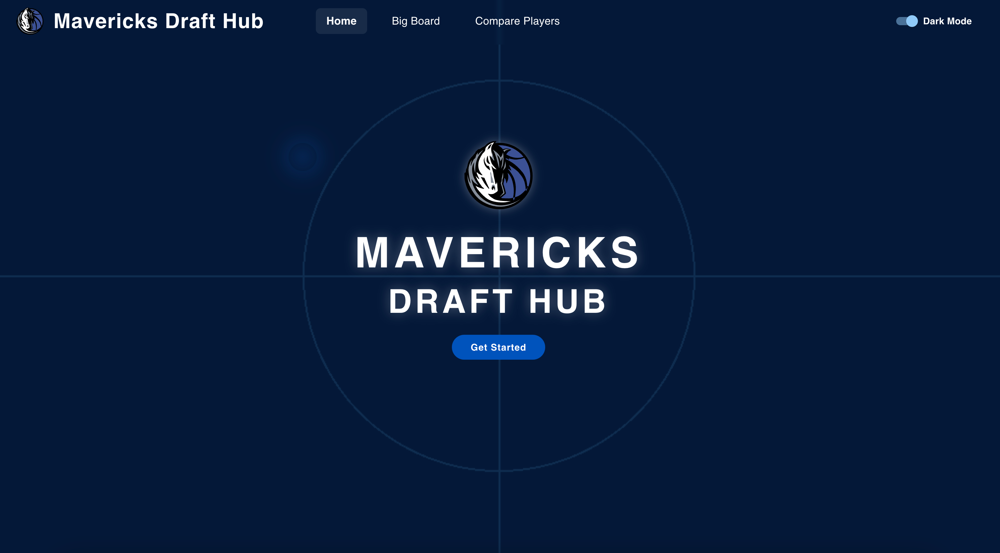
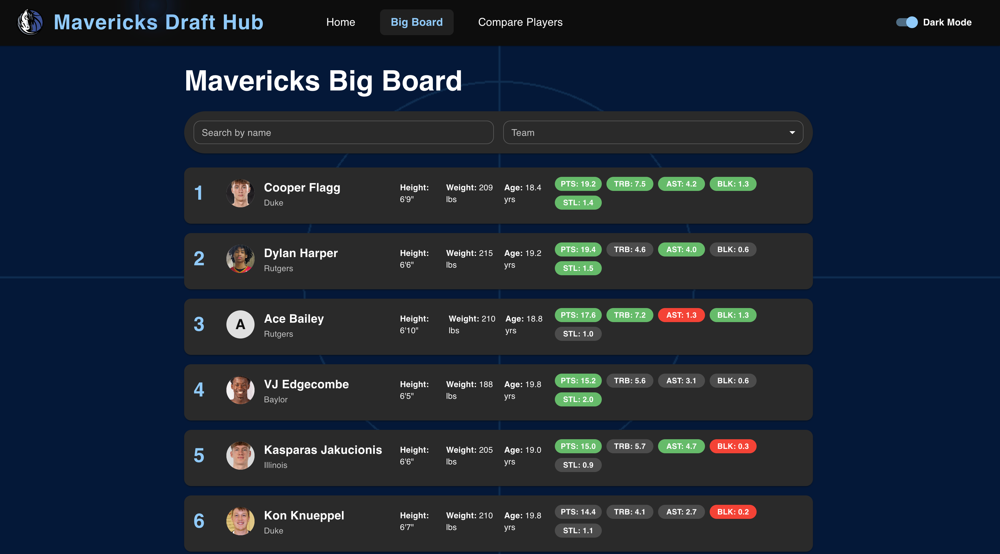
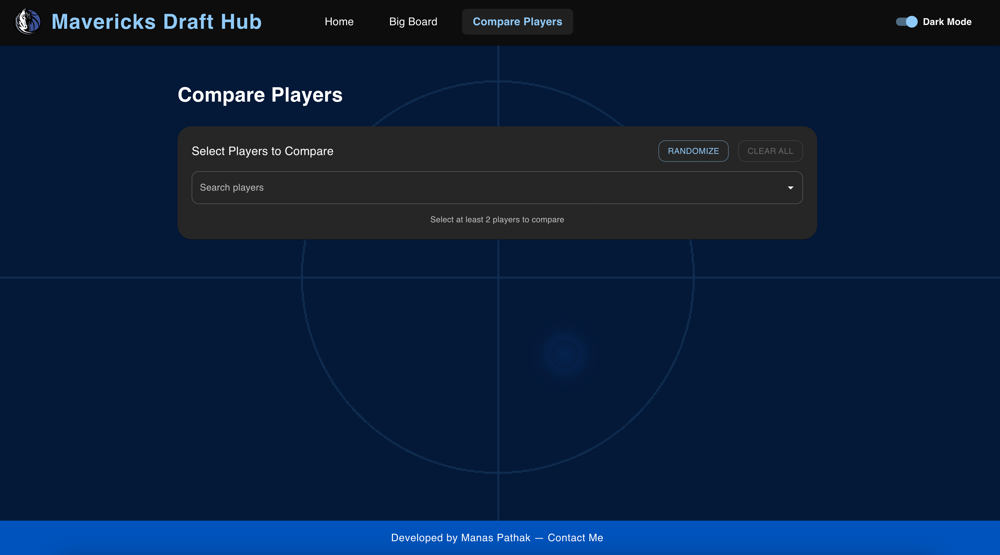

# Mavericks Draft Hub

[](https://mavs-one.vercel.app/)

A modern, interactive NBA draft scouting and comparison tool for the Dallas Mavericks, built with React, TypeScript, Vite, MUI, Tailwind CSS, and more.

---

## 🚀 Features

- **Big Board:** View, sort, and analyze top draft prospects.
- **Player Comparison:** Compare players side-by-side with advanced charts and measurements.
- **Player Profiles:** Deep-dive into individual player stats, scouting reports, and game logs.
- **Scouting Reports:** Submit and view custom scouting notes and ratings.
- **Responsive Design:** Beautiful on desktop and mobile, with dark/light mode support.
- **Animated UI:** Smooth transitions and animated call-to-actions for a modern feel.

---

## 🖼️ Screenshots

### Home Page Hero



### Big Board



### Compare Players



---

## 🛠️ Tech Stack

- **React** & **TypeScript** — Core UI and logic
- **Vite** — Lightning-fast dev/build tool
- **MUI (Material-UI)** — Component library for layout, theming, and accessibility
- **Tailwind CSS** — Utility-first styling and custom animations
- **Framer Motion** — Animations and transitions
- **Recharts** — Data visualization (charts, radar, bar, line)
- **Emotion** — CSS-in-JS for custom styled components
- **React Router** — Client-side routing
- **ESLint** — Linting and code quality
- **Vercel** — Deployment and hosting

---

## 📁 Project Structure

```
mavs/
├── public/
│   ├── bg.png                # Court background image (used in hero/landing)
│   ├── logo.svg              # Mavericks logo
│   ├── players.json          # Player data (bios, stats, measurements, etc)
│   ├── homePageSS.png        # Home page screenshot
│   ├── bigboardSS.png        # Big Board screenshot
│   ├── compareplayerSS.png   # Compare Players screenshot
│   └── ...                   # Other static assets
├── src/
│   ├── pages/                # Main route pages (HomePage, BigBoard, ComparePage, PlayerProfile)
│   ├── components/           # Reusable UI components (charts, tables, selectors, cards)
│   ├── layouts/              # Layout wrappers (MainLayout)
│   ├── utils/                # Utility functions (e.g., stat calculations)
│   ├── types/                # TypeScript type definitions
│   ├── index.css             # Tailwind and global styles
│   └── main.tsx              # App entry point
├── postcss.config.js         # PostCSS config (uses @tailwindcss/postcss)
├── tailwind.config.js        # Tailwind CSS config
├── package.json              # Project metadata and dependencies
└── README.md                 # This file
```

---

## 🧩 Key Components

- **MainLayout:** Handles navbar, background, and page transitions.
- **HomePage:** Hero section with animated CTA.
- **BigBoard:** Main draft board view.
- **ComparePage:** Multi-player comparison with charts.
- **PlayerProfile:** Detailed player info, logs, and scouting.
- **Reusable Components:** Charts, tables, selectors, cards, and forms.

---

## 🛠️ Development

### Install dependencies

```sh
npm install
```

### Start the dev server

```sh
npm run dev
```

### Build for production

```sh
npm run build
```

### Lint

```sh
npm run lint
```

---

## ⚙️ Customization

- **Styling:** Uses both MUI and Tailwind. Custom animations (e.g., hero pulse) are defined in global CSS.
- **Data:** Player data is loaded from `public/players.json`.
- **Theming:** Supports dark and light mode via MUI and Tailwind.

---

## 📦 Deployment

This project is ready for Vercel (see `vercel.json`).  
All static assets are in `public/`, and the app is optimized for static hosting.

---

## 🤝 Contributing

PRs and issues are welcome! Please lint and test before submitting.

---

## 📄 License

MIT

---

> _Developed by Manas Pathak.

---

**Live Demo:** [https://mavs-one.vercel.app/](https://mavs-one.vercel.app/)
